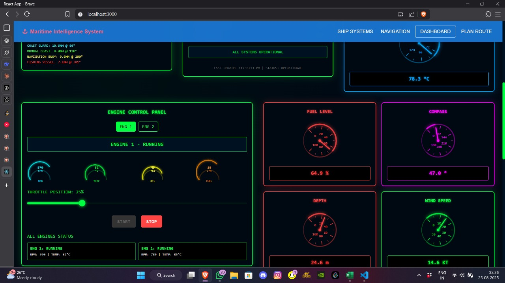
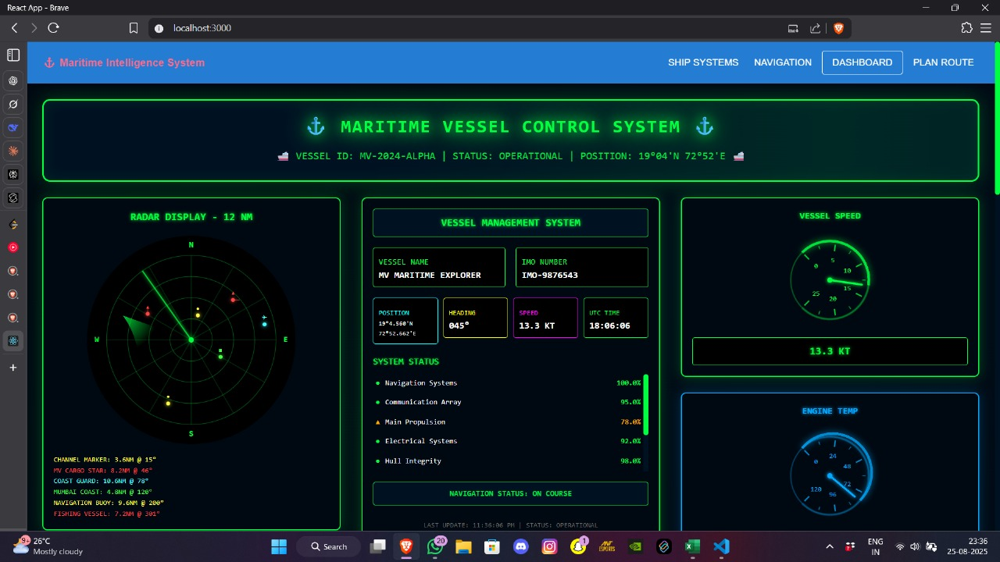
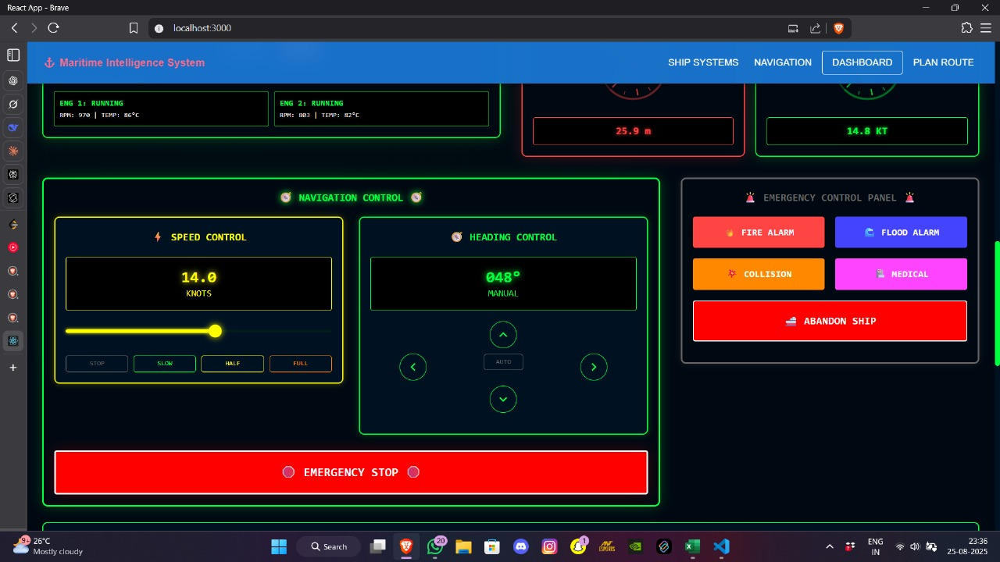

# Sea Navigation System

This is a partial implementation of the Sea Navigation System project. It is not the full implemented version yet, and further development is ongoing to meet all the planned features.

## Current Status
The project currently includes a basic framework using HTML, CSS, JavaScript, and a Flask backend to simulate ocean-only navigation. However, it lacks complete functionality as outlined below. The following features are planned but not fully implemented:

1. **Taking Source and Destination Input**: The system should allow users to input source and destination coordinates (e.g., latitude and longitude).
2. **Displaying a Route on the Map**: Based on the provided source and destination, the system should calculate and display an ocean-only route on the map, avoiding landmasses like Sri Lanka.
3. **Adding a Control Room/Navigator Panel**: A new panel should be created for the control room or ship navigator, which predicts the weather for the next 6 km based on factors like wind, humidity, pressure, and rain. If the weather is unfavorable, it should suggest an alternative route.
4. **Visualizing Everything on the Map**: All routes, weather conditions, and ship movement should be displayed on the map interface.
5. **Ship Movement with Weather Updates**: The ship should move forward continuously, and the weather for the upcoming 6 km should update at each step. The system should indicate whether the route is safe or dangerous based on these updates.
6. **Image Documentation**: Screenshots of the project implementation are included, though uploading to GitHub has faced issues due to some reasons.

## Planned Features
- **Input Handling**: Enhance the UI to accept source and destination coordinates dynamically.
- **Route Calculation**: Integrate a more robust backend to calculate ocean-only routes based on user input.
- **Weather Prediction Panel**: Add a panel to display real-time weather forecasts (wind, humidity, pressure, rain) for the next 6 km, with logic to detect unsafe conditions.
- **Route Re-calculation**: If weather conditions are hazardous, the system should automatically suggest and display an alternative safe route.
- **Dynamic Ship Animation**: Implement continuous ship movement with weather updates every 6 km, marking the route as safe or dangerous.
- **Map Visualization**: Ensure all elements (routes, weather zones, ship position) are visually represented on the Leaflet map.

## Project Screenshots
Due to difficulties in uploading to GitHub, the following images represent the progress of the implementation:

- **tb1.jpg**: Initial setup of the map with coastal outlines and default Mumbai to Kolkata route.
- **tb2.jpg**: Simulation of ship movement with basic hazard detection (incomplete weather panel).
- **tb3.jpg**: Attempted control room panel design (work in progress).

## Future Work
- Integrate a weather API for real-time data on wind, humidity, pressure, and rain.
- Enhance the backend to handle dynamic route re-calculation based on weather conditions.
- Complete the control room panel with interactive weather predictions.
- Resolve GitHub upload issues to include the full set of project images.

